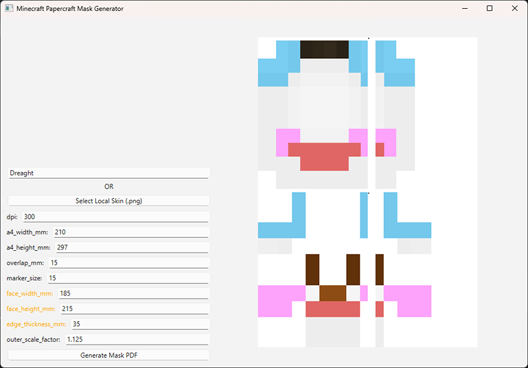

# Minecraft Papercraft Mask Generator 🎭

This tool generates a printable A4 PDF mask from a Minecraft skin, including the outer layer (hat/mask).
You can use either a Minecraft username or a local PNG file.
The app previews the final PDF of papercraft.




## Features

- Input a Minecraft **username** or select a local `.png` skin
- **Live PDF preview** inside the app (up to 4 pages)
- Fully editable settings (paper size, face width, edge thickness, etc.)
- Output file saved as **`papercraft-mask.pdf`**

## Usage

1. Run `skin2mask.py` (See [Build](#a-namebuilda-build) section below)
2. Enter a Minecraft username or select a local skin
3. Adjust the settings if needed (especially orange ones)
4. Click **Generate Mask PDF**
5. The result is shown on the right and saved as `papercraft-mask.pdf`

## Configuration
| Field                | Description                              |
| -------------------- | ---------------------------------------- |
| `face_width_mm`      | Width of the face image in mm            |
| `face_height_mm`     | Height of the face image in mm           |
| `edge_thickness_mm`  | How thick the border edges are           |
| `dpi`                | Print resolution (dots per inch)         |
| `a4_width_mm`        | Page width (default A4 = 210mm)          |
| `a4_height_mm`       | Page height (default A4 = 297mm)         |
| `overlap_mm`         | Overlap margin between pages             |
| `marker_size`        | Size of black alignment markers          |
| `outer_scale_factor` | Scale multiplier for the outer hat layer |

## Notes

- The skin must be a **64x64** format Minecraft skin.
- You can print the generated PDF on A4 paper, cut it out, and glue it to a box or mask base.
- Use cotton pads to secure the outer layer of the mask.

## <a name="build"></a> Build

Virtual Python environment
```shell
python -m venv .venv
```
Activate on Windows:
```shell
.venv/Scripts/activate.ps1
```
Activate on Linux / macOS:
```shell
source .venv/bin/activate
```
Install dependencies:
```shell
python -m pip install -r requirements.txt
```
Run the app:
```shell
python skin2mask.py
```